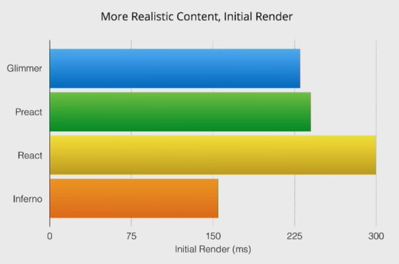
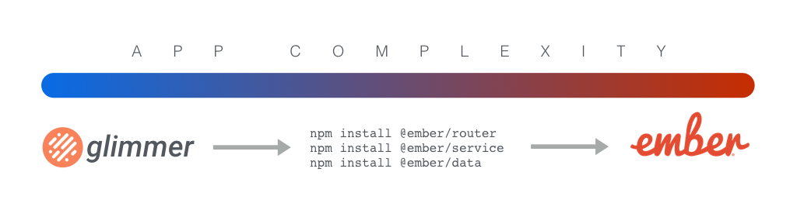

# EmberConf 2017 Recap

Ben Limmer  
@blimmer

4/26/2017

---

## Ember Community Survey
## Keynote
## Talk by Talk

***

## Ember Community Survey

nearly 1600 responses, done every year with emberconf

---

## By Version


many people are using LTS versions, though lots keep up to date with the most current, likely because of glimmer 2.

---

## "How can we improve Ember?"

> Performance was a common theme regardless of experience with Ember. Documentation and guide improvement requests were more common from developers with less Ember experience while requests for tree shaking, routable components and mobile support were more prevalent among experienced Ember developers.

---

## "How long have you been working with Ember?"


almost half of survey participants using ember for > 2 years

---
## "How many people use your apps?"


most target hundreds or thousands of users

---
## "What does the server stack look like?"


---

[View Community Survey](https://emberjs.com/ember-community-survey-2017/)

***
***

## Keynote

A great summary since the last EmberConf and what's next.

---

## Speakers

* [Yehuda Katz](https://twitter.com/wycats) (Ember, RoR, jQuery core teams, yarn, hbs, etc, etc)
* [Tom Dale](https://twitter.com/tomdale) (Ember Core Team)

[video](https://www.youtube.com/watch?v=TEuY4GqwrUE)
---

## Main Topics
* Things that went well in 2.x
* Glimmer Deep(ish)-dive
* Things that didn't go well in 2.x
* The future of Ember

---

## What Went Well
* [fastboot](https://ember-fastboot.com/)
  * server-side pre-rendering of ember applications for speed and SEO
* [engines](https://github.com/ember-engines/ember-engines)
  * isolated, composable applications (similar to rails engines)
* [glimmer](https://glimmerjs.com/)
  * a performant rendering engine that was drop-in compatible with existing ember apps

---

## Glimmer

* The third iteration of the rendering engine used by ember
* Now available stand-alone as [glimmer.js](http://glimmerjs.com/)
* glimmer 2 was a **drop-in replacement**

---

<iframe width="560" height="315" src="https://www.youtube.com/embed/i2rwIApjz-4" frameborder="0" allowfullscreen></iframe>

---

## Glimmer Specifics
* No more root attribute (template is the root)
* True es6 class syntax
* Typescript
* es6 getters and setters (no `.get` and `.set` in glimmer)

---

## Glimmer Performance

* Ahead of time wire-format to describe DOM operations (slim)
```
// Top-Level Template
["open-element","h1",[]]
["flush-element"]
["append",["unknown",["title"]],false]
["close-element"]
["text","\n"]
["open-element","div",[]]
["static-attr","class","posts"]
["flush-element"]
["text","\n"]
["block",["each"],[["get",["posts"]]],[["key"],["id"]],0]
["close-element"]
```
* 'boot up fast and stay fast once booted'

---



---


---

## Future of Glimmer and Ember
* "this is the component API we want for Ember"
* "ember is still the choice for big web applications"
* "glimmer is the choice for small mobile apps that need to be very performant"

---

## What Did Not Go Well
* communication of...
  * `<angle-bracket>` syntax
  * routable components
  * pods

---

## How to Mitigate in the Future
* Unlock experimentation via a small kernel with hooks
* Early adopters experiment with the add-on
* Once things are drop-in compatible, consider merging

---

## Future of Ember



---


---

## Questions?

:hamster:

***

## Talk by Talk

***

## Going Progressive with Ember

* [Samanta de Barros](https://twitter.com/sami_dbc)
* Engineer at WyeWorks in Uruguay


[slides](https://speakerdeck.com/sdebarros/going-progressive-with-ember)
[video](https://www.youtube.com/watch?v=OR1Tk_bwmZo)

---

## What is a progressive app?
* native-app like functionality from a web app
  * looks good
  * installs on device (fast second boot)
  * works offline
  * is fast

---

## watch this talk if interested in...
* app manifests
* appcache
* service workers
* localforage
* offline web apps

***
***

## A Neurobiologist's Guide to Mind Manipulation
* [Casey Watts](https://twitter.com/kyloma)
* Engineer at Heroku, background in Software & Psychology


[slides](https://www.slideshare.net/CaseyWatts/neurobiologists-guide-to-mind-manipulation-08)
[video](https://www.youtube.com/watch?v=AtefvXagutM)

---

## Discusses how to...
* improve processing emotions
* improve processing thoughts
* interact more effectively with coworkers

---


---

## watch this talk if interested in...
* something more non-technical
* learning more about "cognitive restructuring"

***
***
## Understanding JavaScript Performance
* [Godfrey Chan](https://twitter.com/chancancode)
* Ruby on Rails and Ember Core Team Member


[slides](https://speakerdeck.com/chancancode/understanding-javascript-performance)
[video](https://www.youtube.com/watch?v=7ylQThr3EeQ)

---

## also `gem install canada`

```
>> [].empty_eh?
=> true
>> [1,2,3].empty_eh?
=> false
>> [].respond_to_eh?(:empty_eh?)
=> true
>> aboot Object.new
=> "#<Object:0x007f802b8b92c0>"
```

---

## Discusses how to...
* debug performance in
  * your code
  * the framework
  * in v8

---

## watch this talk if interested in...
* JavaScript performance debugging techniques
* the performance tab of Chrome dev-tools
* v8 internals

***
***

## Counter-spells and the Art of Keeping Your Application Safe
* [Ingrid Epure](https://twitter.com/ingridepure)
* Full-Stack Engineer at Intercom in Scotland


[slides](https://speakerdeck.com/ingride/counter-spells-and-the-art-of-keeping-you-application-safe)
[video](https://www.youtube.com/watch?v=kPar8n9zaHo)

---

## Discusses:
* how to use the browser's content security policy to mitigate xss
* dangers of `htmlSafe`
* using helpers to sanitize html content in user input
* OWASP [Top 10 List](https://www.owasp.org/index.php/Category:OWASP_Top_Ten_Project)

---

## watch this talk if interested in...
* securing a front-end application
* common attacks on web apps

***
***

## Rebuilding Tumblr as a Single Page App
* [Oli Griffiths](https://twitter.com/Oligriffiths)
* Engineer at Tumblr


[video](https://www.youtube.com/watch?v=AqJk9P66dsU)

---

* tumblr is not an ember app
* done as part of a hack-day
* created POC in Ember and React
* testament to ember's add-on community and ease-of-use

---

## watch this talk if interested in...
* addressing how to rebuild an app with ember

***
***

## Animate the Web with Ember.js
* [Jessica Jordan](https://twitter.com/jjordan_dev)
* Biologist turned Front-End Engineer


[slides](https://jessica-jordan.github.io/animate-the-web-with-emberjs)
[video](https://www.youtube.com/watch?v=wFJPIjRTIVU)

---

## Discusses:
* how to create an animated comic in ember
* keyframe animation
* web animation API


---

## watch this talk if interested in...
* HTML5 Canvas
* web animation API
* comics and drawing

***
***

## Data Loading Patterns with JSON API
* [Balint Erdi](https://twitter.com/baaz)
* Ember Consultant in Budapest


[slides](https://speakerdeck.com/balint/data-loading-patterns-with-json-api)
[video](https://www.youtube.com/watch?v=kPxiiAGMSzE)

---

## Discusses:
* the basics of ember-data's API
* data fetching strategies (lazy fetching, preloading, side-loading)
* searching
* sorting
* pagination

---

## watch this talk if interested in...
* how to use ember-data
* learning how to expose data from an API to a front-end app
* JSON API
* server-side sorting, searching and pagination

***
***

## Higher Order Components

* Miguel Camba
* Ember, Ruby and Elixir Consultant in London


[game](https://gist.github.com/cibernox/5a46bb73d5690679a7fe07f6b4a5e55e)
[video](https://www.youtube.com/watch?v=MpFudGJn2J0)

---

this presentation was :raised_hands:

---

## Discusses:
* utilizing contextual components
* using `yield`, `hash` and `component` helpers
* focuses on how to compose components to keep them clean

---

## watch this talk if interested in...
* how to build clean ember components
* composability concepts in ember
* creating clean separation between container and presentational components

---

## shameless plug...
[my presentation on composability](https://www.slideshare.net/BenLimmer/fun-with-ember-2x-features)

***
***

## end of day 1!
questions?

***
***

## Empowering the Next Million Creators

* [Edward Faulkner](https://twitter.com/eaf4)
* Ember Core Team member, creator of Liquid Fire (ember's animation library)


[cardstack](http://cardstack.io/)
[video](https://www.youtube.com/watch?v=9DsBHKj90EY)

---

> Our mission is to build a Card Ecosystem based on Open Web technologies and Open Source ethos that fights back against rampant lock-in.

---


---

## cardstack allows you to...
* use a CMS (like Drupal) for data persistence
* allow a web developer to set up the template for the page
* allows (non-technical) users to edit content in-line
* leverage git to "preview" changes
* leverage elastic search for automatic full-text-search on content

---

## watch this talk if interested in...
* building an app that will be frequently edited / appended after delivery
* leveraging the power of a CMS to drive the content for an ember app

***
***

## SVG Animation and Interaction in Ember

* [Jen Weber](https://twitter.com/jwwweber)
* UI/UX Developer at BioBright


[slides](https://drive.google.com/file/d/0BxL5EMSDOzzwOVhaeE1kNi0xWUk/view)
[video](https://www.youtube.com/watch?v=ZC3lD_DFlkc)

---

## Discusses how to...
* create an SVG-driven component
* make an SVG more accessible
* optimize SVGs

---

## watch this talk if interested in...
* SVG
  * optimization
  * creation
  * animation

***
***

## Mastering Ember from the Perspective of a N00b

* [Madison Kerndt](https://twitter.com/mkerndt)
* Technical Associate at TechStars, attended Turing School


[video](https://www.youtube.com/watch?v=BdUL_txyqcw)

---

## Discusses:
* the challenges of learning ember as a self-proclaimed n00b in Turing School
* dreyfus model of skill acquisition
  * novice
  * competence
  * proficiency
  * expertise
  * mastery

---

## watch this talk if interested in...
* hearing the challenges of approaching a framework with no dev background
* learning more about the dreyfus model

***
***

## State, Time and Concurrency

* [Alex Matchneer](https://twitter.com/machty)
* Ember Core Team Emeritus, FutureProof Retail


[slides](http://machty.s3.amazonaws.com/emberconf2017/index.html)
[video](https://www.youtube.com/watch?v=VEzVDOmY-dc)

---

## Discusses
* "the user is an async operation"
* ember-concurrency
* utilizing derived state from `task`s *\**

---

## watch this talk if interested in...
* getting rid of flags in your code like `isSending`
* ember-concurrency *(srsly if you're not using it, look into this talk)*
* "the fourth dimension" of async tasks
* why "the user is an async operation"

***
***

## Confessions of an Ember Add-on Author

* [Lauren Tan](https://twitter.com/sugarpirate_)
* Engineer at Netflix


[slides](https://speakerdeck.com/poteto/emberconf-2017-confessions-of-an-ember-addon-author)
[video](https://www.youtube.com/watch?v=ln_DvmQsvis)

---

## Discusses:
* What (generally speaking) makes a good OSS project:
  * "It solves a useful problem"
  * "People are convinced your solution is the best for their problem"
* Provides a good Developer Experience:
  * Good documentation
  * Demo
  * Good testing
  * Clear Configuration Instructions

---

## watch this talk if...
* you have (or are considering) open-sourcing a project
* you want to know more about how an ember add-on is built
* you want to know more about ember-cli's hooks for add-ons

***
***

:zap: talks!

***
***

## Magnum A.P.I: Adventures in Docs

* [David Baker](https://twitter.com/acorncom)
* [Todd Jordan](https://twitter.com/tddjordan)
* Learning Core Team

 

[video](https://www.youtube.com/watch?v=043GIQQDkO8)

---

## Discusses:
* Versioned API docs for ember :raised_hands:
* New infrastructure for docs
* Search :magnifying_glass:

[beta docs](https://emberjs.com/api-beta/ember/2.12.0/namespaces/Ember)

---

## watch this talk if...
* you want to know about the architecture of the new docs site
* you're curious about the future of the emberjs.com site

***
***

## Ember + VR: Bring Your A-Frame

* [Kelly Selden](https://twitter.com/kellyselden)
* Engineer at Classmates.com


[video](https://www.youtube.com/watch?v=I3o3lV_yfIE)

---

## Discusses:
* A-Frame library for VR ("an HTML wrapper for three.js and WebVR")
* How to use Ember to manipulate A-Frame markup

---

## watch this talk if...
* you're interested in VR technologies

***
***

## Baby's First Open Source Project

* [Liz Baillie](https://twitter.com/_lbaillie)
* Engineer at Tilde


[video](https://www.youtube.com/watch?v=F1UQLBIezHk)

---

## Discusses:
* Degenderettes safety app
* Building an OSS project from scratch
* The ember community helping with OSS projects

---

## watch this talk if...
* you want to start your own open-source project
* to learn strategies for recruiting others to help with your project

***
***

## What's new in QUnit

* [Trent Willis](https://twitter.com/trentmwillis)
* Lead Maintainer for QUnit


[video](https://www.youtube.com/watch?v=8SzNe0gy_mY)

---

## Discusses:
* QUnit CLI for node testing
* QUnit `todo` tests (allows errors in tests for partially implemented features)
* new assertion types (order dependent tests with `step`)

---

## watch this talk if...
* you have a project that uses QUnit
* you want to use qunit for your node projects

***
***

## Instrumenting Ember Apps with Heimdall

* [Chris Thoburn](https://twitter.com/Runspired)
* Engineer at LinkedIn


[video](https://www.youtube.com/watch?v=MxmVV3dcXZk)

---

## Discusses:
* debugging / monitoring performance in your JS apps
* core concepts of heimdall (`timers`, `counters`) and when to use them

---

## watch this talk if...
* you want to try heimdall to debug or monitor perforamnce in your app

***
***

## TypeScript & Ember
* [Daniel Rosenwasser](https://twitter.com/drosenwasser)
* Program Manager of TypeScript @ Microsoft


[video](https://www.youtube.com/watch?v=951HiqnNQ1w)

---

## Discusses:
* Why TypeScript?
* Shows some examples of editor / in-line help with TypeScript
* TypeScript language support / autocomplete

---

## watch this talk if...
* you have never used TypeScript
* you're wondering what the hype is with TypeScript

***
***

## </ :zap: >

***
***

## Spin Me a Yarn

* [Serena Frisch](https://twitter.com/serifritsch)
* Product Engineer at Intercom


[video](https://www.youtube.com/watch?v=4VsLIBb5kxM)

---

started off with a most excellent joke about


---

## Discusses...
* issues with npm (and why they're issues)
  * non-determinism
  * performance
* how yarn is different
  * consistent, reliable dependency resolution
* how a `npm install` works, step-by-step
* how a `yarn install` works, step-by-step

---

## watch this talk if...
* you don't know about how yarn is different from npm
* you're not using yarn yet
* you want to know why npm is, by definition, non-deterministic
* you want to learn how npm / yarn install work

***
***

## An Animated Guide to Ember Internals

* [Gavin Joyce](https://twitter.com/gavinjoyce)
* Engineer at Intercom


[video](https://www.youtube.com/watch?v=A5k2u7AZf6g)

---

## Discusses:
* the fundamental difference between a traditional and closure action
* how the glimmer VM builds and flushes a stack (with amazing animations)

---

## watch this talk if...
* you're curious about how the glimmer VM works
* why closure actions are exciting in ember
* you want to be wow-ed by great animations

***
***

## Closing Keynote

* [Sarah Mei](https://twitter.com/sarahmei)
* Founder of RailsBridge, Consultant, Dev


[video](https://www.youtube.com/watch?v=mz3l_oEA2cU)

---

a really great talk :raised_hands:
if you're a dev working on a team, watch it!

---

## Codebase as a home

> our code is a place we live

---

## Codebase as a home

* it's not something to be "finished"
* it should be "livable for the devs who live there"
  * this will look different depending on the kinds of devs who live there
* getting a new team member is like getting a new roommate
  * they might bring their old couch :laughing:
  * they **will** change what it's like to live there

---

## "Hoarding" parallel
* clutter/problems in a codebase appear over time, not all at once
* cleaning up all at once will not fix the problem
  * e.g. with a big refactor or rewrite
  * the **people who live there** will not change

---

## Cleaning Up Tech Debt
* do it piece-by-piece
  * it's like cleaning your house
  * make it part of your routine to clean as you go
* don't make things worse
* value improvement over consistency
* do refactoring inline
  * clean up problems as you see them

---

## Dealing with Tech Debt

### Don't...
* Ask for permission. This is part of your job!
* Ask for forgiveness. but, learn everytime!

### Do...
* Ask for advice on refactoring. but, don't always take the advice!
* Work together because you all live here!

---

## watch this video if...
* you're a developer working on a team
* you're working for a company that's high-growth

***

Thank you for listening! :ear:

---

## Questions?

Slides can be found at [http://bit.ly/emberconf-2017](http://bit.ly/emberconf-2017)

Ben Limmer  
@blimmer
